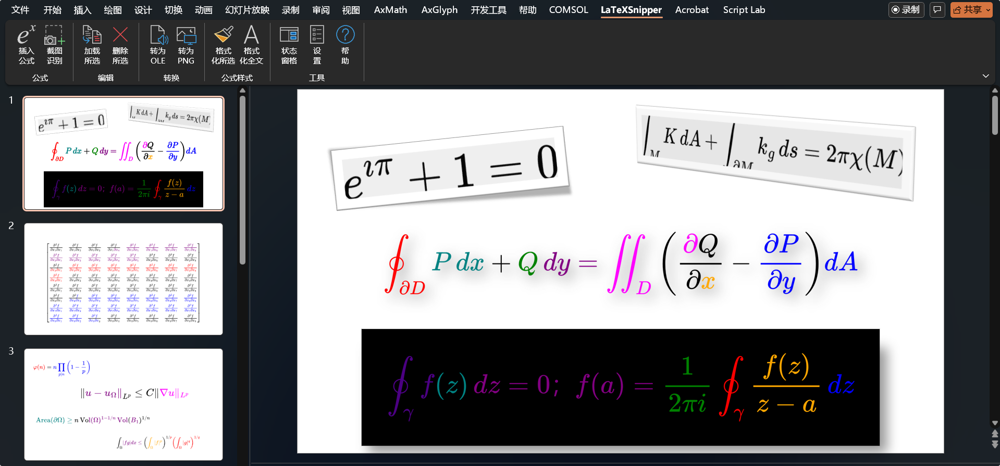
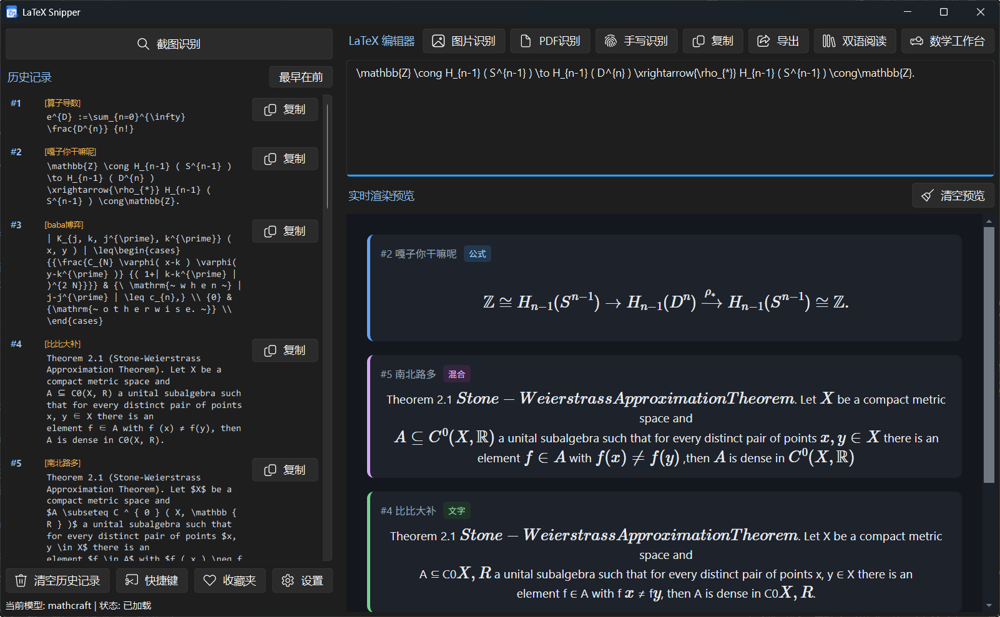

# LaTeXSnipper：开源全平台 LaTeX 公式工作台与 Office 插件

> 截图即识别、手写即输入、桌面端与 Office 无缝衔接

---

## 一、项目简介

LaTeXSnipper 是一款开源的桌面数学工作台，以 **「截图 → 识别 → 手写 → 编辑 → 计算」** 为主线工作流。它同时提供了 **Windows Office VSTO 插件**，在 Word 和 PowerPoint 中实现 LaTeX 公式插入、自动编号、交叉引用等完整功能。

项目采用 GPLv3 协议，支持 **Windows / Linux / macOS** 三平台。截至 v2.3.2 版本，GitHub 已获 280+ Star，社区活跃。

---

## 二、桌面端能做什么

### 1. 截图识别——看到公式就能变成 LaTeX

在论文、PDF、网页上看到一段数学公式，截个图，LaTeX 代码就出来了。不需要手动敲，不需要拍照上传云端，直接在本地完成。

- 截 **纯公式** → 得到 LaTeX 代码
- 截 **文字 + 公式混排的页面** → 得到 Markdown 结构化文档
- 截 **一整页 PDF** → 逐页识别，输出 LaTeX/Markdown
- 没 GPU 也能跑，笔记本集显一样用；有 NVIDIA 显卡会自动走 CUDA 加速

场景举例：读英文论文时，截一段公式下来直接变成 LaTeX，贴到自己的Obsidian/Typora笔记或论文里。

### 2. 手写识别——拿笔写就能转成公式

打开手写板，用鼠标或触控笔写数学符号，软件自动识别成 LaTeX 公式。适合在课堂上快速记笔记，或者在平板上写写画画直接出公式。

### 3. 公式编辑器——像打字一样编辑公式

基于 MathLive 的可视化编辑器，左侧所见即所得编辑，右侧同步显示 LaTeX 源码。不熟悉 LaTeX 语法也能插入复杂公式；LaTeX 熟手可以直接敲代码，两边实时联动。

### 4. 多格式导出——写博客、写论文、做 Slides，总有一种适合你

识别或编辑好的公式/文档，一键导出：

- **写论文：** LaTeX 代码、MathML、Word (.docx)
- **写博客：** Markdown、GitHub Markdown、HTML、Jira Wiki、MediaWiki、reStructuredText
- **做 Slides/网页：** SVG 矢量图、PNG 图片
- **发布电子书：** EPUB、ODT
- **玩新花样：** Typst（新兴排版语言）

内置已覆盖 10+ 种常用格式；装上 Pandoc 后扩展到 **30 多种**，基本上你能想到的文档格式它都支持。

### 6. 隐私优先——你的数据只在你的电脑上

所有截图、图片、PDF、手写识别、数学计算，全部在本地处理，不上传云端。只有在你自己选择使用外部 AI 模型或远程翻译时，数据才会发送到你指定的服务。

---

## 三、Office 插件——在 Word 和 PowerPoint 里用 LaTeX

LaTeXSnipper 提供 Windows 原生 VSTO 插件，兼容 Office 2019 / 2021 / 2024 / LTSC / Microsoft 365（32 位和 64 位都支持）。

安装后，Word 或 PowerPoint 的功能区会出现一个 **LaTeXSnipper** 专用标签页，所有功能一键即达。

### Word 插件能做什么

| 功能 | 用法场景 |
|------|---------|
| **插入公式** | 行内公式、行间公式、带编号公式——LaTeX 写好，插件自动渲染成 Word 原生格式 |
| **截图识别** | 在 Word 里写论文时，看到其他资料的公式，截个图直接把公式插入进来 |
| **加载/修改/删除** | 已插入的公式可以重新加载到编辑器中修改，改完再更新回去，编号不乱 |
| **自动编号** | 给行间公式加编号，可以选左编号或右编号、阿拉伯/罗马/字母编号格式 |
| **全篇重编号** | 调整了章节顺序？一键重新排列所有公式编号 |
| **章/节分隔符** | 写长篇论文时，公式编号自动带上章号（如 (1.1)、(1.2)），层级分隔符可选 `.` `-` `·` `:` `/` |
| **交叉引用** | 在正文中插入"如图 3 所示"这种引用，点击公式编号即可生成，Word 原生支持刷新 |
| **公式转换** | OLE 对象和 Word OMML 格式之间互转，按需切换 |
| **格式重置** | 公式字体乱了、颜色不对？一键恢复默认 |
| **字体/颜色设置** | 设定新插入公式的默认字体（TeX 原生/罗马/粗体/斜体）和字体颜色 |
| **快捷键** | 全部操作都支持键盘快捷键，不用反复点鼠标 |

**两个细节值得一提：**

- 公式渲染支持两种方式：**OLE 公式对象**（默认，跨版本兼容性好、保真度高）和 **Word OMML**（可在 Word 里双击编辑）。两种都在插件本地完成，不需要打开桌面端
- 只有**截图识别**需要和桌面端通信，其余所有操作插件自己搞定

### PowerPoint 插件能做什么

幻灯片里插入公式同样简单：

- 插入 OLE 或 PNG 格式的公式图片
- OLE ↔ PNG 互转
- 选中公式可以加载到编辑器修改，修改后再更新回去
- 格式乱了？一键重置

PowerPoint 的公式始终是独立图片，没有 Word 那种行内/行间区分，也不支持编号和引用——这些是 Word 文档的专属能力。

### 侧边栏编辑器——2121 个符号随取随用

Word 和 PowerPoint 共享同一个 MathLive 公式编辑器，里面内置了 **18 个分类、2121 个数学符号和公式模板**，覆盖从初中数学到微分几何、量子场论、弦论的全部符号体系。找不到某个符号？搜中文名或 LaTeX 指令就能定位。

---

## 四、下载与安装

**桌面端：**

| 平台 | 怎么装 |
|------|--------|
| Windows | GitHub Releases 下载 `LaTeXSnipperSetup-*.exe`，一键安装；或 Microsoft Store 直接装 |
| Linux | 下载 `.deb` 包（Debian/Ubuntu） |
| macOS | 下载 `.dmg` 或 `.app.zip` |

首次启动运行"依赖向导"，自动配置识别模型和运行环境，不需要手动折腾。

**Office 插件：**

下载 `OfficePluginSetup-*.exe`，以管理员身份运行。安装前关掉所有 Word 和 PowerPoint 窗口即可。

---

## 五、许可证

- 桌面端与 Office 插件：**GPLv3**（允许商用，必须开源）
- MathCraft OCR 引擎：**MIT**

---

- 项目主页：https://github.com/SakuraMathcraft/LaTeXSnipper
- 用户手册：https://latexsnipper.interknot.dpdns.org/user_manual.html
- 反馈与建议：https://github.com/SakuraMathcraft/LaTeXSnipper/issues
